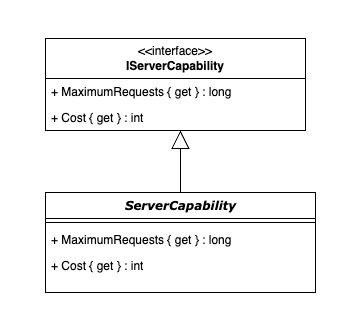
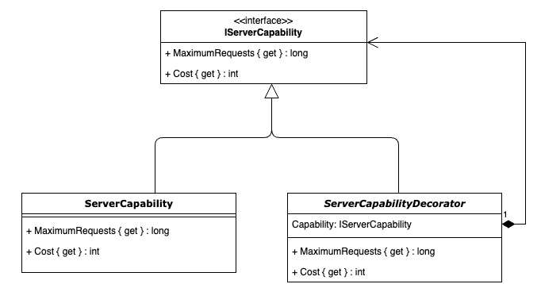
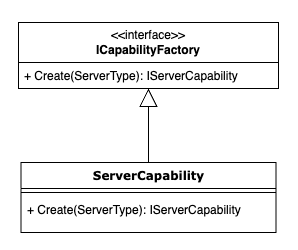

# Assignment 6: 

In this assignment, we continue to build our Infrastructure Simulator. Now, we are shifting our focus from Traffic Routing to Server Capabilities. Servers have distinct capacities and associated costs. We will use the Decorator Pattern to add capabilities flexibly and the Factory Pattern to streamline the creation of server configurations.

## Part 1: Establish the Basic Server Capability

Implement a basic server capability that defines the default parameters for all servers.

A server capability will have a standard 1000 Maximum Requests and a cost of $2500. 
Implement the Server capability as it is shown in the next image:

### 🏁  Commit Your Changes
    

## Part 2: Extend Using the Decorator Pattern

We want to increase a server's maximum capability by adding other capabilities. This would be a good opportunity to use the Decorator Pattern.

Create an implementation of the Decorator Pattern as displayed below:

### 🏁  Commit Your Changes
    

## Part 3: Create Specific Capabilities Decorators

Implement concrete decorators for each additional capability. These decorators will multiply the request capacity and add to the overall cost.

 

**Additional Capabilities:**

| Capability          | Capacity  | Cost  |
|---------------------|-----------|-------|
| TemporaryStorage    |   100     | 1000  |
| TrafficDistribution |   10000   | 1500  |
| EdgeServer          |   1000    | 50000 |
 
  

### 🏁  Commit Your Changes
    

## Part 4: Construct a Server Capabilities Factory 

Simplify and standardize the creation of server configurations by implementing a Factory Pattern.

 

**Server Types & Their Capabilities**

| ServerType          | Capabilities                                                               | 
|---------------------|----------------------------------------------------------------------------|
| Server              |   ServerCapability                                                         |  
| Cache               |   ServerCapability & TemporaryStorage                                      |
| LoadBalancer        |   ServerCapability & TrafficDistribution                                   |
| CDN                 |   ServerCapability & TemporaryStorage &  TrafficDistribution & Edge Server |

 
Create a factory that accepts a ServerType as input and returns the properly decorated server capability instance.

 

**Tip:** Use the *switch* syntax to simplify your code.

### 🏁  Commit Your Changes
    

## Part 5: Validate Your Implementation with Unit Tests

Implement the unit tests for the factory covering all cases and ensuring the expected cost and capacity is returned.

**Tip:** Consider using a Theory (parameterized tests) to test multiple scenarios within a single test method.

### 🏁  Commit Your Changes
    

# Final Reminder

⚠️ Don’t Forget: Push your code to this assignment remote repository once you have completed all parts of the assignment. This assignment is designed to deepen your understanding of both the Decorator and Factory Patterns while improving your unit testing skills.

Good luck, and enjoy building your Servers Capabilities! Use these guidelines to structure your solution, and feel free to experiment and ask questions as you work through the assignment.