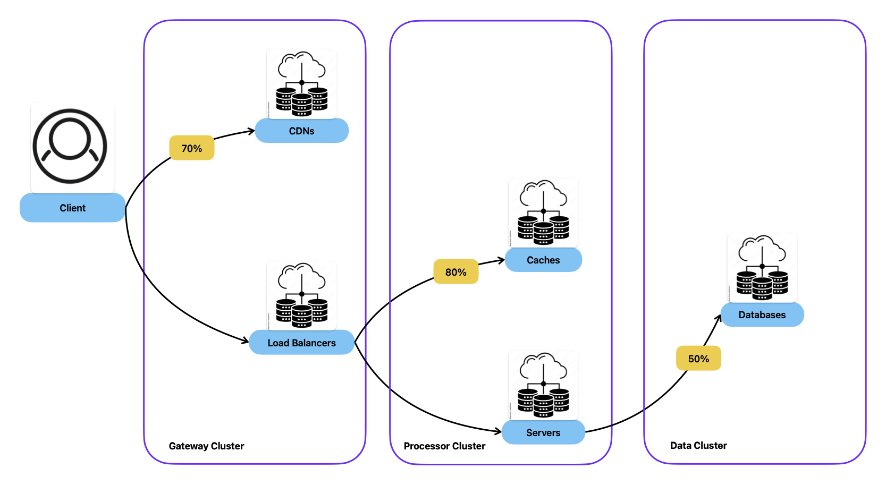

# ES-A13 - Upgrading your Infrastructure to handle Data

Your infrastructure simulator has grown throughout the semester. Now, we are introducing a critical component to most production-grade infrastructures: **Database Servers**. These servers form their own **Data Cluster** and include a special **Persistent Storage** Capability.

Your challenge is to extend the system to integrate these new server types and routing logic while maintaining the extensibility, maintainability, and separation of concerns promoted throughout the classes.

Persistent Storage Capability:
- Increases the server's Maximum Request Capacity by x100
- Adds an additional €13,000 to the server's cost

## Assignment Goals

- Add a new ServerType

- Create a PersistentStorage capability with the values defined above.

- Update your `Create` in `CapabilityFactory` to return the desired capability for the database server.

- Create a `DataValidator` similar to the `GatewayValidator`, expecting only Database servers.

- Add a new method in `ServerFactory` to return a Data Cluster, which queries for database servers on the database.

- On `InfrastructureMediator`, update the clusters tree structure to add the new data cluster.

Still on `InfrastructureMediator`, update the `AddServer` to handle the case of adding database servers.

- Also, on `InfrastructureMediator`, update the `IsOK` method to accept the visit in the Data cluster.

- Create a new Traffic Routing for `Database`.

- Add the new Traffic Routing to the chain.

- On the visual representation, update the ServerInfoAdapter to set a name and an icon.

Finally, update your resolution file with the supported users' new values and costs.

### 🏁 Commit Your Changes

    

## Final Reminder

- Ensure your infrastructure simulator builds and runs correctly
- Verify all changes are tested and committed
- Push your code to the remote assignment repository

## Final Words

As you've seen, making a critical architectural change, like adding data support, did not break your codebase. Your project remains extensible, testable, and maintainable thanks to Clean Code practices and the proper use of SOLID principles and Design Patterns.

It has been a pleasure guiding you through these assignments. I hope you now feel confident applying these principles in real-world systems. Best of luck in your future engineering endeavours!