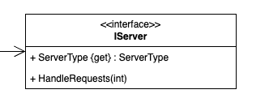
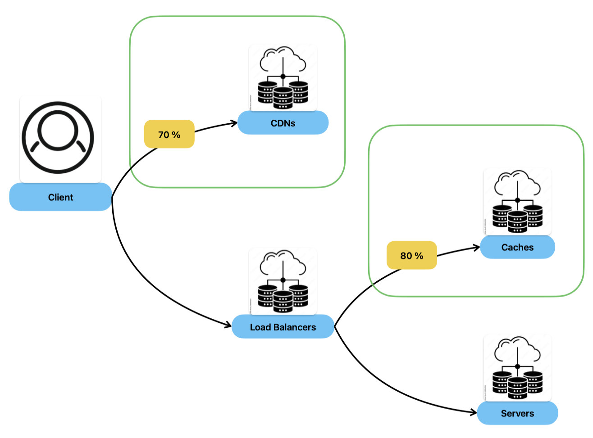

[](https://classroom.github.com/a/vBh8TXjn)
# Assignment 5: Advanced Traffic Routing with Template Method

In this assignment, you will extend your previous traffic routing simulation by implementing multiple types of traffic routing strategies. This work will give you the opportunity to:

1.	**Leverage Enums** to manage various server types required by each routing strategy

2.	**Implement the Template Method pattern** to maintain a consistent structure while selectively overriding behavior for different routing strategies.

3. **Enhance your unit testing skills** by expanding your test coverage.

By the end of this assignment, you will have designed flexible and maintainable traffic routing systems customized for different server configurations, along with robust tests to validate your implementations.

<div style="margin-top:80px;"></div>

## Part 1: Managing Multiple Server Types

Our Infrastructure Simulator will manage various types of servers:

- CDN
- Load Balancer
- Cache
- Server

### 1. Create an Enum for Server Types:

- Define an enum that handles the different types of servers.

- [Learn more about enums](https://learn.microsoft.com/en-us/dotnet/csharp/language-reference/builtin-types/enum).

### 2. Update the IServer Interface:

- Add a ServerType property to your existing IServer interface.



<br>

### 🏁  Commit Your Changes
<br><br><br><br>


## Part 2: Understanding the InfraSim routing

For our Infrastrucuture Simulator, traffic flows as described in the diagram below:



**Key Points:**

- CDN and Cache Routing:

  - Two distinct routing needs exist: one for CDNs and another for Caches.

- Load Balancers and Servers:

  - Thes will handle 100% of the remaining traffic. A generic approach can be applied here.

### 1. Create classes for:

- `CDNTrafficRouting`
- `CacheTrafficRouting`
- `FullTrafficRouting`

<br>

### 🏁  Commit Your Changes
<br><br><br><br>


## Part 3: Implementing the Template Method

> Template Method is a behavioral design pattern that defines the skeleton of an algorithm in the superclass but lets subclasses override specific steps of the algorithm without changing its structure.


### 1. Make `TrafficRouting` an abstract class.

- Convert your TrafficRouting class into an abstract class.

### 2. Define Abstract Methods

- Identify and mark the methods that should be abstract, ensuring the subclasses will implement them.

- **Note:** Abstract methods cannot have any implementation.

### 3. Project Integrity:

- Ensure your InfraSim project compiles without issues.

- **Note:** we will not look into the tests project at this stage, even if failing.

<br>

### 🏁  Commit Your Changes
<br><br><br><br>


## Part 4: Implementing Specific Routing Behavior

Now its time to implement the specs of each routing system.

### 1. Subclass Implementation: 

- Inherit `CDNTrafficRouting`, `CacheTrafficRouting` and `FullTrafficRouting` from the TrafficRouting abstract class.

### 2. Implement Abstract Members:

- Provide concrete implementations for the inherited abstract members according to the specifications.

- **Tip** To query a List, consider using [Where method](https://learn.microsoft.com/en-us/dotnet/api/system.linq.enumerable.where?view=net-9.0#system-linq-enumerable-where-1(system-collections-generic-ienumerable((-0))-system-func((-0-system-boolean)))).

- **Tip** FullTrafficRouting requires the server type, once it is a generic traffic and it does not know to which servers to send the traffic. You can use the constuctor to pass this parameter.

<br>

### 🏁  Commit Your Changes
<br><br><br><br>


## Part 5: Testing Your Implementation


### 1. Review Existing Tests

- Note that tests for TrafficRouting are now invalid because it’s abstract. Instead, reuse these tests for FullTrafficRouting by configuring the ServerType to Server.

- **Tip** configure the ServerType of the IServer mock:
```csharp
mockServer.Setup(s => s.ServerType).Returns(ServerType.Server);
```

### 2. Create New Test Files

- Write tests for `CDNTrafficRouting` and `CacheTrafficRouting`.

<br>

### 🏁  Commit Your Changes
<br><br><br><br>


# Final Reminder

⚠️ Don’t Forget: Push your code to this assignment remote repository once you have completed all parts of the assignment. This assignment is designed to help you understand not only the Template Method design pattern but also interface design, class implementation, and unit testing with mocking.

Good luck, and enjoy building your Traffic Routing Infrastructure! Use these guidelines to structure your solution, and feel free to experiment and ask questions as you work through the assignment.