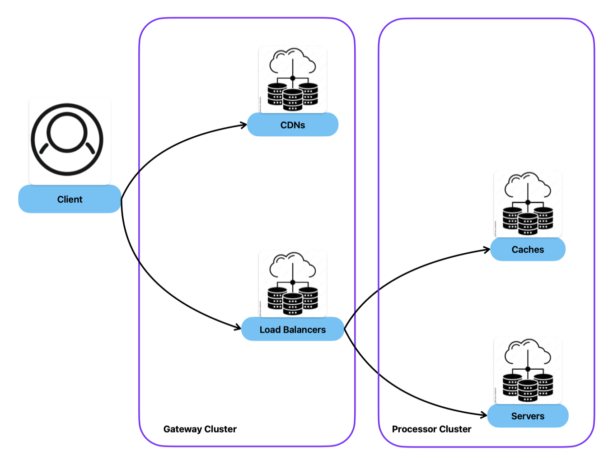
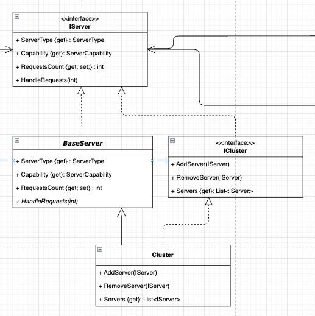
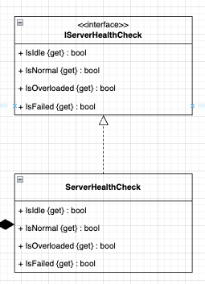
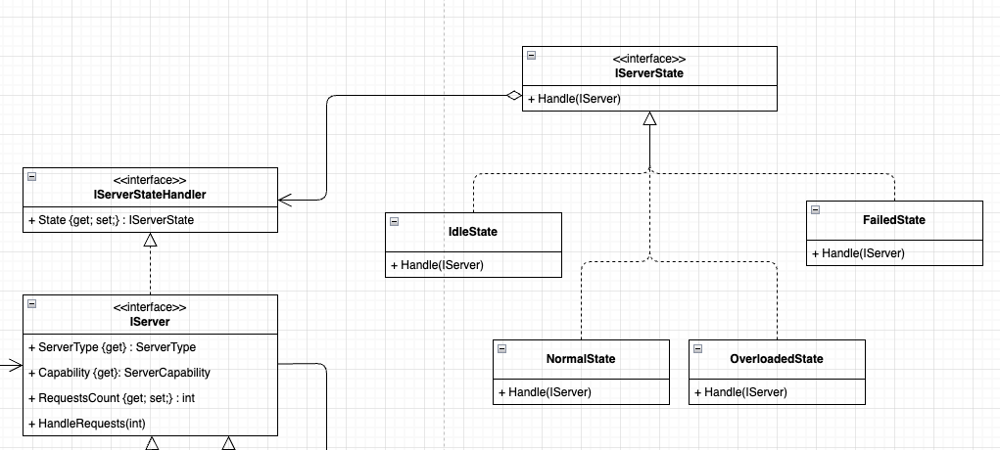

[](https://classroom.github.com/a/91RciJe8)
# Assignment 7: Server Definition and State Management

In this assignment, you will extend your infrastructure simulation by implementing server clusters and state management using the Composite and State pattern. This work will give you the opportunity to:

1. **Utilize the Composite Pattern** to handle both individual servers and clusters uniformly.
2. **Implement the State Pattern** to track and update server load conditions dynamically.
3. **Apply the Facade Pattern** to simplify server health checks.
4. **Enhance Unit Testing** by increasing test coverage for state transitions and server load management.

By the end of this assignment, you will have developed a flexible and scalable server management system, complete with dynamic state transitions and robust testing.


## Part 1: Update IServer and create Base Server

- Add the ServerCapability and an integer Requests for representing the server current load.


- Create an abstract BaseServer to populate the current load when HandleRequests is called. This will just hold the value of the amount of requests.


You can implement your RequestsCount such as:
    
```csharp
    private int Requests = 0;
    public int RequestsCount { 
        get{
            return Requests;
        } 
        set{
            Requests = value;
        }
    }
```
- implement your HandleRequests method, which will set the RequestsCount.

- Pass the missing values in a constructor, such as the ServerCapability or ServerType.

<br>

### 🏁  Commit Your Changes
<br><br><br><br>

## Part 2: Create Your Cluster

A server cluster is a group of interconnected servers that work together. This will help to build our infrastructure as shown in the image below:



This is a great opportunity to implement the Composite Pattern, as described in the next image:




### 1. Define `ICluster` Interface:

- Add methods to handle a list of servers.

- Extend `ICluster` from `IServer`.

### 2. Update your ServerType

- Add Cluster to the `ServerType` Enum.

### 3. Implement `Cluster` Class:

- Extend it from `BaseServer` and implement `ICluster`.

- Implement the required constructor and interface methods.

**Tip:** You don't need the ServerType to be pass on `Cluster`'s constructor. Set it as Cluster when calling the base.


<br>

### 🏁  Commit Your Changes
<br><br><br><br>

## Part 3: Health Check with Facade

Our server will have 4 states with the following characteristics:

| State | Current Load (RequestsCount) |
|-------|------------------------------|
| Idle  | 0                            |
| Normal | > 0 && < 80%                |
| Overloaded | > 80% && < 100%         |
| Failed | >= 100%                     |

To avoid contaminating the server model with these calculations, we can implement a facade to provide a unified interface and perform its calculations.


### Implement `IServerHealthCheck` & `ServerHealthCheck`:
- Create an interface and implementation for server health checks.
- **Tip:** Pass `IServer` in the constructor.



<br>

### 🏁  Commit Your Changes
<br><br><br><br>

## PArt 4: Build your State Management

For the state management we will apply the State Design Pattern.


### 2. Define `IServerState` and `IServerStateHandler`:
- Keep state awareness separate from `IServer`.
- Update `BaseServer` to include state awareness, modifying the constructor as needed.
- Ensure `Cluster` handles state updates properly.


### 3. Implement Concrete State Classes

- Create the `IdleState`, `NormalState`, `OverloadedState`, and `FailedState`.
- Implement the `Handle` method in each class to check the server's health and update the state.

Example of Normal State:
```csharp
public void Handle(IServer server)
    {
        ServerHealthCheck healthCheck = new ServerHealthCheck(server);
        if(healthCheck.IsIdle){
            server.State = new IdleState();
        } 
        else if(healthCheck.IsOverloaded){
            server.State = new OverloadedState();
        } 
        else if(healthCheck.IsFailed){
            server.State = new FailedState();
        }
    }
```


### 4. Modify `BaseServer`:
- Call the state `Handle` on the state object whenever `RequestsCount` changes.

### State UML


<br>

### 🏁  Commit Your Changes
<br><br><br><br>

## Part 5: Verify With Unit Tests

### Increase Test Coverage:

- Add tests for `ServerHealthCheck`.

- Verify state transitions when modifying `RequestsCount`.

<br>

### 🏁  Commit Your Changes
<br><br><br><br>

# Final Reminder
⚠️ Don’t forget to push your code to the assignment repository once all parts are complete. This assignment is designed to reinforce composite design principles, state management, and robust unit testing.

Good luck, and enjoy building your server infrastructure!
